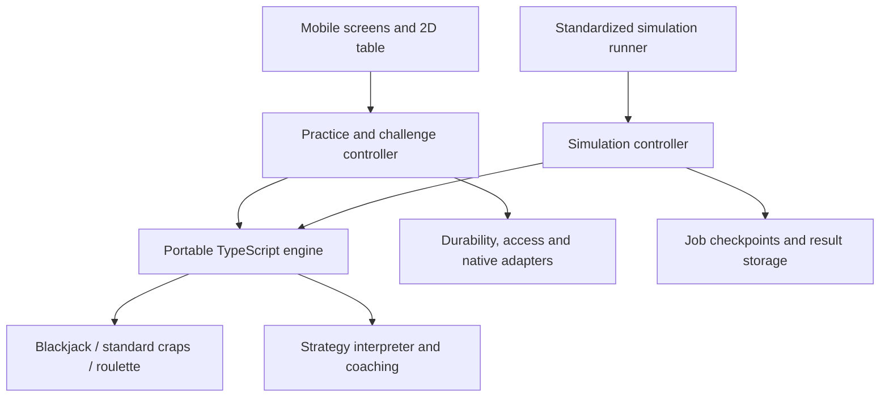

# Mobile platform and shared game-engine architecture — accepted decision

Accepted through Q1–Q12 and the integrated Q13 review for [Mobile platform and shared game-engine architecture](https://github.com/0xRowdy/true-count/issues/16). The resolution comment on that issue records acceptance; this file preserves the reviewed architecture and implementation contracts, including the concrete random protocol and parser/evaluator guards. This is a planning decision, not an implemented engine or a claim that its validation has passed.

## Scope and technology

Use TypeScript, React Native with Expo development builds, and bundled Hermes for the polished 2D iOS/Android app. Run the same portable engine package in Node workers for standardized simulations. Keep the engine usable by a future browser consumer; a browser UI is outside launch. All three launch games and built-in strategies ship with the app. Saved community revisions are versioned data prepared for offline use under the accepted access policy.

Use one repository with a mobile application, a headless simulation runner, and shared engine/definition packages. The engine has no React, Expo, Node-only, network, storage, clock, account, advertising, or subscription dependency. The mobile application supplies native adapters; the runner supplies server adapters. Pin a supported Expo/React Native/Hermes combination, Node LTS, dependencies, and compiled artifacts in the implementation. Toolchain upgrades repeat compatibility checks; selecting exact patch releases at scaffolding is maintenance work.

The [runtime investigation](https://github.com/0xRowdy/true-count/issues/24#issuecomment-5564346430) supports this choice given the accepted language and presentation preferences. Flutter/Dart and Kotlin Multiplatform are viable alternatives but add another language without an identified capability requirement. A separate Rust/native engine needs evidence of a bottleneck sufficient to justify its additional bindings and build surface. No throughput or cloud-cost claim is established here.

## Modules and ownership

The game modules own game state, legal actions and wager targets, increments/limits, dealing or outcomes, settlement, removability, and information exposure. A common session protocol coordinates them without forcing cards, craps contracts, and roulette placements into one universal game-state model. The strategy interpreter owns revisioned prescriptions, per-bet counters, progression lists, conditions, priorities, fallbacks, and structured explanation facts. Teaching assessment retains the actual reference count separately from learner answers.

Standard-craps-specific rules belong to its module and versioned capability description. Future crapless craps receives its own variant identity, rules, and compatibility checks. A strategy compatible with standard craps does not automatically become compatible with the later variant.

Controllers decide when to request the next legal engine step. The practice controller handles corrections, overrides, explicit cycle restarts, challenge checkpoints, and presentation. The simulation controller follows the selected revision without learner mistakes or overrides and automatically restarts normally completed cycles as the benchmark permits. Neither controller reimplements legality, payouts, strategy evaluation, or final settlement. Both use the same transition semantics.

## Execution interface

The engine exposes a small interface with these responsibilities; internal game and teaching interfaces remain private to its implementation.

| Operation | Contract |
| --- | --- |
| Validate definitions and configuration | Check supported schema/versions, game capabilities, references, legal targets and amounts, defaults/fallbacks, instruction conflicts, explicit caps, and declared complexity. Return structured diagnostics and compatibility information. |
| Create activity | Accept a complete pinned activity specification and explicit random stream identity; produce the initial serializable state. Creation does not implicitly grant access or consume allowance. |
| Advance activity | Accept the current state and one typed command; return a candidate next state and ordered private domain facts, or reject a malformed/stale command envelope. A submitted action that fails legality may still produce a durable assessment transition with unchanged wagers. Deterministic computation has no external effects. |
| Read permitted view | Derive the view permitted by the activity's stored phase/mode and recorded assistance choices. Return observable game information, legal choices, and currently permitted feedback. A caller cannot grant itself review access with a boolean flag. |
| Encode/decode checkpoint | Validate and canonically serialize the complete state and its version identities. Unsupported or damaged records return an explicit recovery error. |

Commands include beginning a permitted turn, taking a playing/betting action, answering or skipping a checkpoint, retrying/overriding a correction, resolving a pending action, revealing an allowed learning aid, restarting a completed cycle, requesting a stop, and advancing automatic final settlement. Each command is legal only in defined phases. A UI tap or animation callback never advances a game implicitly.

Distinguish an invalid command envelope or malformed count input from a meaningful submitted action. Legality enforcement must not erase a submitted strategy error: preserve applicable assessment/deviation facts and an idempotent command receipt even when game/wager state stays unchanged. Check exposes only the permitted legality diagnostics while deferring correctness feedback. Resending a command cannot create another attempted error. Malformed count input remains unsubmitted until corrected; an explicit skip follows the accepted incorrect-answer behavior.

State distinguishes an open decision, generated/revealing outcome, settled outcome, pending strategy action or correction, cycle completion, automatic final settlement, completed activity, and unusable/incomplete recovery. Game-specific substates refine these phases. Interruption preserves the phase; resuming does not mean starting a new turn. A stopped activity cannot return from final settlement to interactive play.

## Strategy format and explanation behavior

Saved and published strategies are validated, immutable instruction data interpreted by the engine. They do not contain executable author JavaScript, imports, network calls, arbitrary recursion, or general-purpose loops. The versioned format supports the accepted guided all/any conditions, amounts and targets, explicit priorities/exceptions, atomic action groups, per-bet counters, editable progression lists, defaults and legal fallbacks, outcome adjustments, and stop/completion rules. Incomplete private drafts remain saveable without being runnable.

Validation covers both shape and semantic compatibility. Static checks cannot prove every possible dynamic prescription legal; each actual action group is checked again against current table state and funds. A conflict or uncovered invalid action is explained, never resolved by incidental instruction order. An atomic group either executes completely or remains pending without partial bets or state advancement.

Game settlement and the next strategy adjustment are separate transitions. In the accepted place-6 example, the win credits 14 before a proposed press from 12 to 24 is found incompatible with a maximum of 20. The saved state contains the settled payout, unchanged stake and pre-press counter, plus a pending action tied to that outcome. Resolving the pending action cannot pay the outcome again. An explicit collect-instead progression override ends the cycle and follows final settlement before an explicit restart.

The engine produces structured explanation facts: observed situation, matching instruction, prescription, unavailable action/fallback, and resulting strategy state. Presentation turns these into localized prose and previews. Author notes supplement executable instructions and cannot change behavior. Tutorial/preview consumers use the same interpreter; illustrative prototypes are not engine references.

## Hidden information and trust

The private checkpoint may hold a shuffled shoe, concealed cards, random state, reference answers, and deferred assessment. These never enter the ordinary renderer's view, analytics payloads, general logs, or crash breadcrumbs. Strategies and simulated players observe only information legally available at their decision; a negative blackjack peek does not reveal a rank. Count updates follow exposure, including the required final hole-card reveal.

Check enforces legality immediately but withholds strategic correctness, preferred-action ordering, answers, and explanations until permitted review. The restriction covers the builder, generated descriptions, previews, accessibility text, and explanation trails as well as the table. The explicit reference-count reveal is the accepted exception: commit the assisted status before exposing the count, and never clear that status by hiding it. Learn preserves first-answer accuracy after retries. Between configured checkpoints, never infer an unsubmitted learner count.

Attempted deviations and their eventual retry/override resolutions are durable append-only facts with stable identities. Resolving a correction must not erase the original attempt or mutate prior scoring evidence. The player-facing deviation log retains the accepted single-departure meaning while recovery preserves any pending correction.

Offline device data is not promised to be tamper-proof on a compromised device. Access/account isolation and ordinary information hiding remain requirements. Server-run standardized simulations alone provide public performance evidence; a client-supplied seed, transcript, or result cannot replace an authoritative evaluation. Opted-in practice remains separately labeled observational data, and casino sessions remain strictly private.

## Exact money and supported limits

Represent execution amounts as normalized rational values backed by integers: numerator and positive denominator, reduced to a canonical form. Use BigInt arithmetic for intermediate money operations and encode integer components as canonical decimal strings across persistence/transport. Comparisons, affordability, increments, payouts, and net outcomes use exact values. Apply rounding only where the selected rules prescribe it, such as the accepted whole-unit upward buy/lay commission rounding. Formatting a fractional result never changes the ledger value.

Accepted technical input limits are 1,000,000 simulation currency units for configurable base-wager limits and 1,000,000,000 cumulative session funding units, excluding winnings. These concern simulated activity inputs, not the casino-session ledger. Attached odds retain their separate accepted odds rules and may exceed the base-wager limit. Legitimate winnings may increase a balance beyond the funding-input ceiling; do not clip or confiscate them. The existing default table limits and ordinary funding decision remain unchanged.

The accepted strategy envelope is 256 instructions, all/any nesting depth 8, and progression lists of at most 1,024 entries. The schema additionally permits at most 4,096 expression nodes across a strategy, with bounded operators and no unbounded evaluation. Lists are typed state data rather than expression nodes. Preserve the accepted strategy catalog within the envelope. A growing list has an explicit declared cap and stop rule shown in the strategy. Reaching that cap stops new bets under that rule; it does not silently truncate the list or invent an outcome. Malformed or unsupported definitions fail before play/publication.

Accepted parser/evaluator guards complete that envelope: a definition is at most 1 MiB encoded UTF-8; each numeric-literal numerator/denominator has at most 40 decimal digits, with a positive denominator; strategy arithmetic intermediates and mutable numeric strategy values have at most 256 bits per integer component. Check encoded sizes before constructing BigInts. Operators are comparisons, Boolean conditions, bounded arithmetic and explicit list/counter operations; exclude exponentiation, arbitrary shifts, recursion, dynamic code, and unbounded iteration or state-key allocation. State names are declared, and per-bet scopes are limited by the game's legal wager set. A dynamic unsupported expression pauses the unexecuted prescription with diagnostics; in a standardized run it blocks valid completion rather than becoming an ordinary loss or a declared strategy stop. These interpreter guards do not cap legitimate engine payouts or accumulated ledger balances.

Runtime memory, worker time slices, or persistence batch limits never become game-outcome rules. A long valid settlement pauses/checkpoints and resumes the same path. Unexpected execution-limit failures keep the record and prevent comparison eligibility; they are not ordinary losses or grounds for replacing a session.

For standardized evidence, derive and validate a finite monetary-exposure bound from each profile's legal target set, per-target limits, odds, split/double/insurance rules, opportunity horizon, and final commitments. Multiple chips on one target cannot bypass that target's accepted limit. This does not add a roulette aggregate table cap. The benchmark uses its accepted 1,000-unit start and 200 scheduled opportunities; final settlement adds no discretionary stakes. Validate exact totals before any conversion into statistical calculations. Range safety must include intermediates and aggregate calculations, not just individual input fields.

## Reproducible random protocol

Use an explicitly versioned **Philox4x32-10** protocol for game/challenge randomness. The published counter-based algorithm supplies four 32-bit output words for a 128-bit counter and 64-bit key. Its original authors recommend ten rounds as a statistical safety margin. This selection favors explicit session indexing and portable integer operations; it is not a measured speed claim or a cryptographic-security promise. [Random123 paper, sections 4.3 and 5.1](https://www.thesalmons.org/john/random123/papers/random123sc11.pdf).

Protocol version 1 defines the counter words as `[blockLow32, blockHigh32, sessionLow32, sessionHigh32]` and the key words as `[keyLow32, keyHigh32]`; begin at block 0/lane 0 and consume output lanes 0 through 3 before advancing the 64-bit block index. Specify all words as unsigned values, and verify multiplication high/low halves against the [reference implementation](https://github.com/DEShawResearch/random123/blob/main/include/Random123/philox.h) and [known-answer vectors](https://github.com/DEShawResearch/random123/blob/main/tests/kat_vectors). Persist the key/stream identity, next block/lane, and any already-generated outcomes. Never wrap counters or reuse a tuple as fresh randomness.

For a standardized run, the server fixes a unique run key and allocates session indices 0 through 99,999 before results are observed. Keep the run-key allocation collision-free within the authoritative registry; keys come from a cryptographically secure source. Each compatible profile's evaluation has its own immutable run identity and allocation. Worker count, queue order, command/job retries, and resume cannot change the session index or stream. For device activities, a secure native entropy adapter creates 16 bytes, interpreted as four little-endian unsigned words: the first two form the key and the next two form the counter's session words. Durably record this identity before first content; displayed clocks are never seeds. Restarting a challenge with fresh content creates a distinct attempt and random identity under the accepted allowance policy; it is different from command/delivery retry or resumption.

Uniform bounded sampling requires integer `1 <= n <= 2^32`, uses unsigned 32-bit draws, accepts values below `floor(2^32 / n) * n`, and maps accepted values with remainder n. Rejected draws still advance the stream. Shuffle using descending Fisher–Yates over a canonical deck order: ascending deck index, suits clubs/diamonds/hearts/spades, then ranks ace through king. At index i, choose uniformly from indices 0 through i; deal from index 0 upward after shuffling. Dice consume two bounded draws of six choices and add one to each. Roulette samples `[0, 1, ..., 36]` or `[0, 00, 1, ..., 36]` uniformly, with `00` a distinct pocket identity. The rules/draw protocol fixes card encoding and draw order. Presentation, timing, explanation rendering, and command/delivery retries consume no additional game draws. Challenge content generation is also versioned.

Require published/reference vectors for the generator and application vectors for sampling, shuffle, game transitions, and resumption on actual iOS Hermes, Android Hermes, and Node. Distinct stream allocations prevent accidental reuse; they alone do not prove statistical independence or simulator validity. Statistical acceptance remains necessary. If the protocol exhausts its representable stream, fail and preserve the evaluation without resampling or treating it as completed.

## Durable transition and interruption contract

Each activity has an account owner, originating device, stable identity, expected sequence, and immutable engine/rule/strategy/reference/random-protocol identities. Each command and each accounting effect has a stable identity. A single controller owns state advancement; a stale sequence or repeated command cannot advance it again.

1. Durably create the activity and its initial random identity. A retry recovers that same activity. No first-content charge occurs until the charged start transition commits.
2. Compute a candidate transition from the committed state and command. Outcomes derive only from the preserved random state. Computation itself does not pay, charge, publish, animate, or change storage.
3. Commit the next checkpoint, command identity, generated outcomes, settlement and balance facts, pending steps/answers, and any allowance ledger effects atomically. Use the prior sequence as a concurrency condition. Initial/repeated effects receive the same identities.
4. After durable success, publish the permitted view and accept the next input. If acknowledgement is uncertain, read the command receipt/checkpoint and return the committed result; do not apply it twice. If no commit occurred, recomputation from the same state preserves the same random result.
5. Complete the activity once, with one final result and a durable outgoing synchronization record. Retried uploads cannot create a second result or apply payouts again.

A save failure pauses new progression and displays saving/retry status. A crash before commit returns to the previous committed state, from which the same random step is recoverable. A crash after commit resumes the committed phase even if its animation never ran. Store pending display/reveal progress where it affects exposure, challenge content, or assessment; cosmetic animation timing is not authoritative. Backgrounding/termination is not a reliable final-save opportunity, so already-shown progress must already be recoverable.

Snapshots retain outstanding wager identities and working states, full shoe/outcome position, applied settlements, per-bet/list strategy state, pending actions, first answers, assistance/interruption flags, deviation facts, funding identity, allowance grant/policy references and effects, and completion state. They contain actual pinned definitions or references to retained immutable local artifacts, not merely a pointer to current content.

The [persistence and synchronization decision](https://github.com/0xRowdy/true-count/issues/21) must choose storage and prove the required durability/transaction behavior, including checkpoint/ledger atomicity, migration, write failure, account isolation and queued synchronization. This interface contract does not imply that a collection of unrelated writes or framework screen-state restoration meets it.

## Access, clocks, and automatic settlement

Account identity, access entitlement, content readiness, allowance ownership, and game state remain distinct. The application supervisor checks authoritative or still-valid cached access before new activity/turns and on accepted lifecycle events. It supplies explicit permissions and stop reasons to controllers; the game engine neither contacts a subscription service nor obtains allowance grants.

When access/allowance ends, finish the already-started round/roll/spin, stop new interactive play, return removable wagers, then automatically settle commitments. Additional craps rolls resolve only existing contracts: no new bets, presses, replacements, or progression restarts. Settlement needs no new access grant and consumes no further training allowance. Its legitimate results remain in the original session/funding record. Restart can resume settlement but cannot reopen interactive play. A started challenge retains its accepted completion exception on its original device.

Allowance usage is a separate accounting module driven by committed activity facts and validated elapsed-time readings. It preserves the accepted distinction between training-turn charges, active-time accounting, first-content challenge charges, and settlement exclusions. Premium transitions and daily resets retain the accepted funding boundaries; they cannot refill an old or new grant through engine payouts.

Native adapters supply sleep-inclusive elapsed time, lifecycle events, secure entropy, and connectivity observations. An access decision distinguishes allowed, denied, and uncertain state and its provenance. Reliable boot continuity must be established before reusing a persisted elapsed-time anchor; a lower-counter check alone is insufficient. Uncertainty follows the accepted reconnect rule while still allowing permitted completion/settlement and saved-history access. Connectivity must distinguish an unusable internet path from a failure of the account service. The existing persistence/subscription tickets own the concrete time/connectivity implementation and verification; this architecture does not certify them.

## Updates, defects, and historical interpretation

Initially distribute executable engine changes through app-store releases. Data-only strategy/content updates use validated supported instruction/reference formats and never introduce remote executable code. New strategy revisions are adopted deliberately, and new sessions select supported current engine/rule/reference combinations. Active sessions, including cycle restarts, remain pinned.

Each release must retain executable behavior and definitions for valid unfinished activities that an earlier supported installation can leave on the device, or provide a tested migration that preserves their accepted semantics and already-fixed outcomes. Skipping intermediate app versions must also work. Do not age out an unfinished activity merely to remove compatibility code. A behavior family can be retired only when migration preserves its supported unfinished states; absent that evidence, retain it. Keep completed history interpretable without requiring every historical engine to execute again.

Keep state-schema versions distinct from game semantics, instruction format, references, random protocol, benchmark profile, analysis, and app/runtime versions. Upgrading one is not permission to reinterpret the others. Release rollback cannot reopen records written by an incompatible schema; implement compatible readers/migrations or block that rollback path. Expo runtime compatibility is a separate native/update concern.

For proven execution defects, quarantine affected combinations with an explanation. Preserve results and valid recovery/settlement where possible; mark genuinely unusable activities incomplete instead of inventing a replacement outcome. Preserve affected standardized evidence as invalid or superseded with provenance, and conduct any corrected evaluation under a traceable new protocol/version. Routine update incompatibility is not a legitimate substitute for implementing recovery support.

## Scheduling and standardized simulation

Run ordinary mobile transitions as bounded work; long preview/automatic-settlement work yields between resumable steps. Animations follow committed state and never own game progression. Profile release builds on representative supported devices. Native rendering may animate independently, but making a JavaScript function async does not move its computation to another thread. A separate compute runtime is a possible measured optimization behind the same interface, with trace-equivalence tests required.

Use a pool of Node workers for server computation with one owner per session. Workers can batch checkpoint writes because an unacknowledged batch replays the same fixed session indices and streams; result keys and completion records prevent duplicate inclusion. Reduce finalized records in stable session order, or use a specified order-independent exact calculation, so worker scheduling does not alter reported evidence. Full explanation strings can be omitted in bulk runs, but authoritative structured execution/settlement semantics cannot change.

Retain the seven accepted profiles, 100,000 completed independent sessions per compatible revision/profile, 200 scheduled opportunities plus final settlement, no-bet and stopped sessions, and the extra benchmark blackjack player. Preserve complete-session denominators, separate component wager outcomes, simultaneous-settlement drawdown, and all public precision/validation gates. An unfinished long settlement retains its place in the run; do not replace it, censor it, refund it, or classify it as zero.

Run identity pins the complete profile, revision, engine/rules/references, random allocation, analysis implementation and configuration. Author submissions cannot select seeds or request favorable rerolls. [Community simulation capacity and operating budget](https://github.com/0xRowdy/true-count/issues/19) owns benchmark measurements, admission/workload, cost ceiling, queue targets, cancellation/supersession and operational scheduling. Its investigation must test representative complex strategies and settlement tails using this runtime; changing the evidence contract requires explicit agreement.

## Implementation acceptance

These are required checks for implementation, not tests claimed to have run during planning.

| Area | Required evidence |
| --- | --- |
| Catalog representation | Encode all four blackjack training modes and their supported rule/reference combinations; all five accepted craps strategies; all five accepted roulette strategies; all four challenge categories and Learn/Check/Observe/Play behavior. Include per-bet counters, bounded Labouchere, priorities/fallbacks and atomic groups. |
| Independent game correctness | Source-backed cases for split/double/insurance/surrender and hole-card exposure; every supported craps contract, working/off rule, commission, odds and proposition component; each legal roulette placement including zero-adjacent and double-zero basket cases. Enumerate supported rule choices and boundary cases, supplementing examples with invariants/property tests. |
| Money and accounting | Exact fractional payouts, independently settled simultaneous bets, commission-adjusted outcome classification, removable stakes excluded from pushes, simultaneous drawdown updates, finite exposure/intermediate arithmetic, and original-funding attribution. |
| Strategy execution | The paid-14/blocked-press case, unaffordable place-6/8 atomic group, independent press counters, Three-point Molly capacity, list progression/declared cap, explicit cycle restart without refill, fallback adherence, and overrides retaining their classification. |
| Information and teaching | Concealed/future-card changes do not affect current permitted prescriptions or views; Check does not leak answers through alternative screens/logs; count reveal permanently marks assistance; first answers and configured checkpoint gaps remain correct. |
| Determinism | Generator/reference vectors and complete transition traces agree in actual iOS Hermes, Android Hermes and Node; serialization round trips, yield/worker-count changes and retries preserve outcomes and hashes. |
| Durability | Inject failure before/after each commit and acknowledgement; restart during reveal, after payout/before adjustment, during correction and during final settlement. Prove one charge, one settlement effect and one final result. Test full disk/write failure and skipped-version upgrade/compatible rollback paths. |
| Access integration | Expiry/reset/sign-out/background/restart during outstanding wagers, uncertain clock, allowance-funded upgrade and account changes follow the accepted lifecycle without blocking legitimate settlement or transferring old payouts into a new grant. Concrete platform/provider checks remain their existing decisions. |
| Simulation evidence | No-bet, skewed, sparse, rare/boundary, positive-balance funding failure and long-tail settlement cases; complete denominators; independent known distributions and statistical coverage checks; no comparison eligibility from a narrow interval alone. |
| Responsiveness and capacity | Measure bounded transition/preview work and settlement yielding in release builds; benchmark representative server workloads. Performance regressions trigger profiling and equivalent optimization, not silent rule/sample reductions. |

Numerical blackjack reference correctness remains with [Blackjack coaching reference validation](https://github.com/0xRowdy/true-count/issues/15). Implement the versioned reference interface without treating unvalidated tables or prototype fixtures as certified coaching. Public evidence and teaching release gates require that investigation's accepted numerical artifacts and corresponding checks.

## Remaining owners and resolution

Provider selection and detailed synchronization, identity, subscription and operating-cost choices remain with the existing [persistence/synchronization](https://github.com/0xRowdy/true-count/issues/21), [authentication/account lifecycle](https://github.com/0xRowdy/true-count/issues/22), [subscription verification](https://github.com/0xRowdy/true-count/issues/23), and [simulation capacity](https://github.com/0xRowdy/true-count/issues/19) decisions. [Practice funding and table-challenge balances](https://github.com/0xRowdy/true-count/issues/20) still chooses ordinary funding behavior/defaults within the accepted technical envelope. [Mobile device support and accessibility](https://github.com/0xRowdy/true-count/issues/25) now owns the supported device/OS, accessible operation and mobile qualification baseline. Visual direction/onboarding/audio/tutorials, broader release readiness, and delivery stages remain map work.

The user accepted the integrated draft in Q13, including the explicit random protocol and parser/evaluator guards. This resolves the mobile platform and shared engine architecture decision. Resolution records a route to implementation; it does not close the remaining decisions or certify the implementation acceptance matrix.
